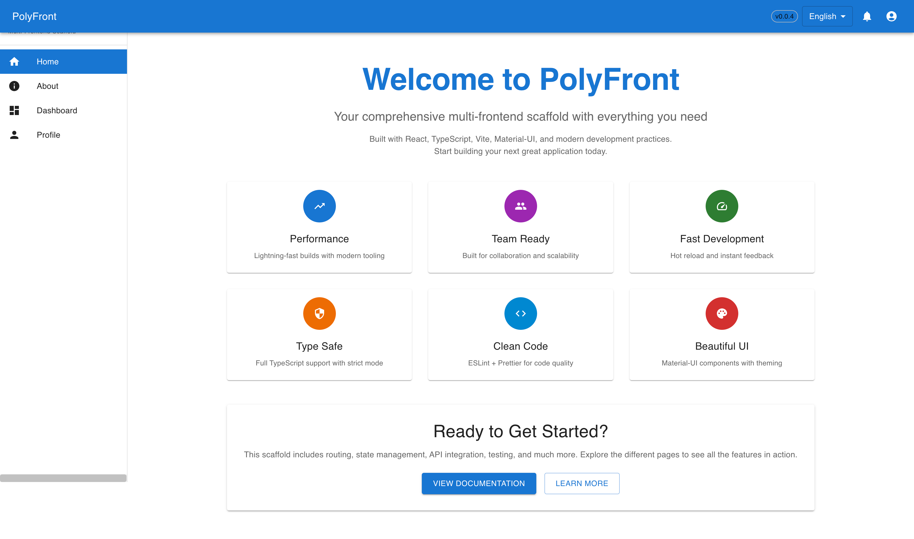
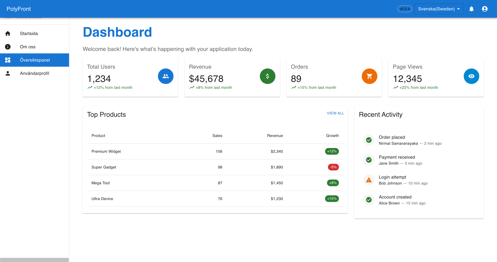
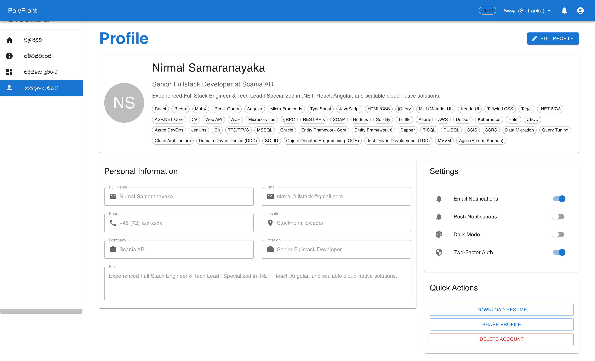

# polyfront-scaffold (v1.0.22)

Author: **Nirmal Samaranayaka** <nirmal.fullstack@gmail.com>  
Repo: https://github.com/NirmalSamaranayaka/polyfront-scaffold

Scaffold **React** (Vite or Webpack) and **Angular** apps with:

- **Language**: TypeScript or JSX (React); Angular uses TS
- **UI (React)**: MUI, Bootstrap, Tailwind, Ant Design, Chakra
- **UI (Angular)**: Angular Material, Bootstrap, Tailwind, PrimeNG
- **State (React)**: none / Redux / MobX / React Query
- **HTTP**: axios (React). **Angular uses HttpClient by default**
- **i18n**: lightweight placeholder (or add i18next later)
- **Dates**: moment/dayjs/date-fns/none
- **Testing**: Jest or Vitest; E2E via Cypress or Playwright
- **Env files**: `.env.development` / `.env.test` / `.env.production` / `.env.example`
- **Folder structure**: `src/{api,assets,components,context,features,hooks,i18n,layout,
                          pages,routes,services,store,styles,tests,utils}`
- Works on **Windows/macOS/Linux** (no bash-only commands)
- Node **>= 20.19** (CI tests Node 20 & 22 on Ubuntu/Windows/macOS)

## Status & Scope

> **UI presets status (React):**
>
> - **MUI** — ✅ **fully tested & supported** (Vite + Webpack)
> - **Bootstrap** — ✅ **fully tested & supported** (Vite + Webpack)
> - **Tailwind** — ✅ **fully tested & supported** (Vite + Webpack)
> - **Ant Design** — ✅ **fully tested & supported** (Vite + Webpack)
> - **Chakra UI** — ✅ **fully tested & supported** (Vite + Webpack)
>
> **Angular** — uses **Angular Material** by default; Bootstrap/Tailwind/PrimeNG scaffold, but considered 🧪 experimental.
>
> If you try an experimental preset and hit issues, please open an issue with steps to reproduce — or even better, send a PR. 🙌

### What we’re improving next
- **Test coverage**:
  - Generator E2E: assert generated projects **install, build, lint & test** across Node **20/22** (Vite & Webpack).
  - **Hooks & utilities**: add sample hooks (data fetching, form) + unit tests.
- **Angular scaffolds**:
  - Strengthening the Angular Material starter (routing, layout, and theme integration).
  - Improving Bootstrap, Tailwind, and PrimeNG presets to ensure styles, components
- **DX**:
  - More consistent **env** handling and route stubs.
  - Hardening style presets (Bootstrap/Tailwind/AntD/Chakra/PrimeNG).
- **Docs**:
  - Short “Style Adapters” guide for contributors.

See **[ROADMAP.md](./ROADMAP.md)** for details.

---

## Demo & Screenshots

> All screenshots live in `docs/screenshots/` with descriptive names.  
> Tip: keep alt text and short captions so the gallery is accessible.


### 🖼️ MUI Screenshots

<p align="center">
  <br/>
  <em>Home — React (Vite) + Material UI starter with router, cards, and call-to-action.</em>
</p>

<details>
  <summary>More (placeholders you can add later)</summary>

  <p align="center">
    
    <br/>
    <em>About & Dashboard — example route-level screens for your app shell.</em>
  </p>

  <p align="center">
    
    <em>Profile (React)</em>
  </p>
</details>

### 🖼️ Bootstrap Screenshots

<p align="center">
  <br/>
  <em>Home — React (Vite) + Bootstrap with router, cards, and call-to-action.</em>
</p>

<details>
  <summary>More (placeholders you can add later)</summary>

  <p align="center">
    
    <br/>
    <em>About & Dashboard — example route-level screens for your app shell.</em>
  </p>

  <p align="center">
    
    <em>Profile (React)</em>
  </p>
</details>

### 🖼️ Tailwind Screenshots

<p align="center">
  <br/>
  <em>Home — React (Vite) + Tailwind with router, cards, and call-to-action.</em>
</p>

<details>
  <summary>More (placeholders you can add later)</summary>

  <p align="center">
    
    <br/>
    <em>About & Dashboard — example route-level screens for your app shell.</em>
  </p>

  <p align="center">
    
    <em>Profile (React)</em>
  </p>
</details>

### 🖼️ Antd Screenshots

<p align="center">
  <br/>
  <em>Home — React (Vite) + Ant design with router, cards, and call-to-action.</em>
</p>

<details>
  <summary>More (placeholders you can add later)</summary>

  <p align="center">
    
    <br/>
    <em>About & Dashboard — example route-level screens for your app shell.</em>
  </p>

  <p align="center">
    
    <em>Profile (React)</em>
  </p>
</details>

### 🖼️ Chakra UI Screenshots

<p align="center">
  <br/>
  <em>Home — React (Vite) + Chakra design with router, cards, and call-to-action.</em>
</p>

<details>
  <summary>More (placeholders you can add later)</summary>

  <p align="center">
    
    <br/>
    <em>About & Dashboard — example route-level screens for your app shell.</em>
  </p>

  <p align="center">
    
    <em>Profile (React)</em>
  </p>
</details>

> **How to add**: save your PNGs into `docs/screenshots/` and update the file names above.

## Installation

### 1️⃣ Global install (recommended)
Install the CLI globally to run it from anywhere:

```bash
npm install -g polyfront-scaffold
```

### 2️⃣ Local / no global install
## Run directly from source:
```bash
# PowerShell/CMD
node .\bin\index.js --interactive

# Git Bash / macOS / Linux
node ./bin/index.js --interactive
```

### Direct flags
```bash
node ./bin/index.js my-app --framework react-vite --ts --ui mui --store none --test-unit vitest --test-e2e none
```

### 3️⃣ Tarball (registry-style, local, no publish)
```bash
npm pack
# PowerShell/CMD
npx polyfront-scaffold@file:.\polyfront-scaffold-{{version}}.tgz my-app --framework react-vite --ts --ui mui
# macOS/Linux
npx polyfront-scaffold@file:./polyfront-scaffold-{{version}}.tgz my-app --framework react-vite --ts --ui mui
```

## Usage
### 1️⃣ Interactive wizard

# Step-by-step setup:
```bash
polyfront-scaffold --interactive
```

### 2️⃣ Direct flags
# Scaffold a project directly without prompts:
```bash
polyfront-scaffold my-app --framework react-vite --ts --ui mui --store none --test-unit vitest --test-e2e none
```

## CLI Flags
- `--framework` → `react-vite` | `react-webpack` | `angular`
- `--lang` / `--ts` / `--js`
- `--ui` → React: `mui|bootstrap|tailwind|antd|chakra` — Angular: `material|bootstrap|tailwind|primeng`
- `--store` (React) → `none|redux|mobx|react-query`
- `--i18n` (bool, default true) — `--axios` (bool, default true)
- `--date` → `moment|dayjs|date-fns|none` (default `moment`)
- `--test-unit` → `jest|vitest|none` (defaults: Vite→vitest, Webpack→jest)
- `--test-e2e` → `cypress|playwright|none` (default `none`)
- `--pm` → `npm|pnpm|yarn|bun`
- `--root <dir>` (default `Frontends`) — `--flat` to use CWD
- `--only-tests` → retrofit test setup into an existing project

## Output layout
```
<cwd>/Frontends/
  React/
    Vite/ or Webpack/
      <project>/
        public/                     # Static assets served as-is (React)
        .env.development
        .env.test
        .env.production
        .env.example
        src/
          api/        # HTTP clients & adapters (React: Axios). Angular: prefer HttpClient services.
          assets/     # Images, fonts, static JSON used by UI (import from code)
          components/ # Reusable presentational components (dumb)
          context/    # React contexts/providers (auth/theme), Angular tokens if mirrored
          features/   # Vertical slices (todos/checkout/profile) mixing UI + logic
          hooks/      # Reusable React hooks (no UI)
          i18n/       # i18n init or minimal t(key) placeholder
          layout/     # App shells, headers, nav, footers
          pages/      # Route-level screens (composition only)
          routes/     # Router configuration
          services/   # Domain/business logic (pure, framework-agnostic)
          store/      # Redux/MobX/Zustand wiring when selected
          styles/     # Global CSS, tokens, Tailwind entry
          tests/      # Central tests or shared helpers (colocate tests near code is OK)
          utils/      # Small helpers (pure functions)

    <project>/
  Angular/
```

## Quick Start Examples

# Scaffold React + Vite + MUI + TypeScript + Vitest
```bash
polyfront-scaffold my-app --framework react-vite --ts --ui mui --store none --test-unit vitest --test-e2e none
```

# Scaffold Angular + Material + TypeScript
```bash
polyfront-scaffold my-app --framework angular --ts --ui material --store none --test-unit jest --test-e2e cypress
```
# Add tests only to an existing project
```bash
polyfront-scaffold existing-app --only-tests --test-unit vitest --test-e2e none
```

## Recommended Defaults (Copy-Paste)
# For a quick React + Vite + MUI + TypeScript + Vitest project:
```bash
polyfront-scaffold my-app --framework react-vite --ts --ui mui --store none --test-unit vitest --test-e2e none
```

## Local / Start directly from git source:

# Vite + TS + MUI + Vitest
```bash
node ./bin/index.js portal --framework react-vite --ts --ui mui --store none --test-unit vitest --test-e2e none
```
# Webpack + JSX + Tailwind + Redux + Jest
```bash
node ./bin/index.js dashboard --framework react-webpack --js --ui tailwind --store redux --test-unit jest
```
# Angular + Material
```bash
node ./bin/index.js backoffice --framework angular --ui material
```

## Testing in generated apps
- **Vitest**: `npm test` (jsdom)
- **Jest**: `npm test`
- **Cypress**: `npm run cypress:open` / `npm run test:e2e`
- **Playwright**: `npm run e2e` / `npm run test:e2e`

> E2E expects `http://localhost:5173` (Vite/webpack dev server).

---

## Contributing (community help welcome!)

We’d love help validating and polishing the experimental UI presets.

**Quick start**
```bash
# clone & install
git clone https://github.com/NirmalSamaranayaka/polyfront-scaffold
cd polyfront-scaffold
npm i

# try generating a project (example: React + Tailwind)
node ./bin/index.js demo --framework react-vite --ts --ui tailwind --on-exists overwrite

cd Frontends/React/Vite/demo
npm i
npm run dev  # verify it boots, routes work, styles load
npm test     # if you selected vitest/jest
```

**If something breaks**, open an issue with:
- your OS, Node version, package manager
- exact command you ran
- terminal output (copy/paste)
- any edits you made

**Want to contribute a fix?**
1. Fork → create a branch: `feat/tailwind-fix-icons`  
2. Make changes + add a minimal test (see `ROADMAP.md` for what we assert)  
3. `npm run lint` in the generated app (if applicable)  
4. Open a PR with a clear description & screenshots

> See **[CONTRIBUTING.md](./CONTRIBUTING.md)** → “Adding or fixing a style adapter” for a 10-minute checklist.

---

## CI/CD
This repo ships `.github/workflows/ci.yml`:
- Matrix: **Node 20 & 22** on **Ubuntu/Windows/macOS**
- Scaffolds a sample app and builds/tests it
- Publishes to npm on **tags** (needs repo secret `NPM_TOKEN`)

### Publish steps

```bash
# bump version in package.json
git commit -am "chore(release): v1.0.0"
git tag v1.0.0
git push origin v1.0.0
```
---

### End-to-End Scaffolding & Verification Guide
- This guide explains how to set up, run, and extend the end-to-end (E2E) scaffolding and verification flow for React (Vite/Webpack) and Angular applications.

See **[E2E.README.md](./docs/end-to-end/E2E.README.md)** for details.

---

## License

MIT © 2025 **Nirmal Samaranayaka** <nirmal.fullstack@gmail.com>
